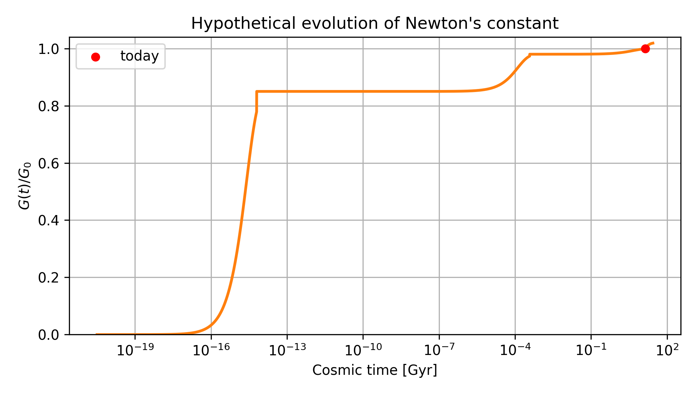

# Variable‑G Hypothesis

*What if a 15 % weaker gravity in the first three minutes, followed by a 2 % future drift, could solve the Li‑7, H₀ and σ₈ tensions—while steering the Universe toward a Big Hole instead of heat‑death?*

---

## Quick links

* **Short 2‑page PDF:** [`docs/short_paper.pdf`](docs/short_paper.pdf)
* **G‑trajectory figure:**  
  

## What is here?
* Python script `code/plot_G.py` that reproduces the figure  
* LaTeX source `docs/short_paper.tex` (minimal draft)  
* Effect table (`docs/effects_table.tex`) summarising Li‑7 / H₀ / σ₈ impact  
* GitHub‑Actions workflow that rebuilds everything on each push